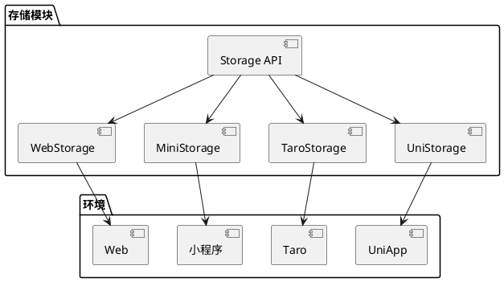

# 存储模块设计文档

## 目标

存储模块旨在提供一个统一的跨端存储 API，支持 Web、小程序、Taro 和 UniApp 环境。通过该模块，开发者可以方便地进行数据的存储、获取、删除和清空操作，简化不同平台的存储实现。同时，模块支持自定义存储实现，增强了灵活性和扩展性。

## 设计原则

1. **统一性**: 提供一致的 API 接口，简化开发者的使用体验。
2. **可扩展性**: 设计时考虑未来可能的扩展需求，支持更多存储方式和自定义实现。
3. **异步处理**: 所有存储操作均使用 Promise 处理，确保异步操作的顺畅。
4. **错误处理**: 提供统一的错误处理机制，确保在存储操作失败时能够及时反馈。
5. **依赖注入**: 通过依赖注入管理存储实现的选择，提高模块的灵活性和可测试性。

## 架构图



## 接口设计

### `StorageItem` 接口

- `key: string`: 存储项的键名。
- `value: any`: 存储项的值。
- `expiresAt?: number`: 可选的过期时间戳，表示存储项的有效期。
- `sizeLimit?: number`: 可选的大小限制，表示存储项的最大大小。

### `Storage` 接口

- `get(key: string): Promise<StorageItem | null>`: 获取存储项。
- `set(item: StorageItem): Promise<void>`: 设置存储项。
- `remove(key: string): Promise<void>`: 移除存储项。
- `clear(): Promise<void>`: 清空所有存储项。

### `StorageConfig` 接口

- `type: 'web' | 'mini' | 'taro' | 'uni'`: 存储类型。
- `customStorage?: Storage`: 可选的自定义存储实现，符合 `Storage` 接口。

## 统一错误处理

- 引入自定义错误类，提供详细的错误信息和类型。
- 所有存储操作的错误都应通过统一的错误处理机制进行处理，确保一致性。

## 性能优化策略

- 支持批量存储操作，允许一次性设置多个存储项。
- 引入异步操作的并发控制，限制同时进行的存储操作数量，以提高性能。

## 各存储实现

### WebStorage

- 使用 `localStorage` 进行数据存储。
- 提供标准的 `get`、`set`、`remove` 和 `clear` 方法。

### MiniStorage

- 使用微信小程序的存储 API。
- 提供标准的 `get`、`set`、`remove` 和 `clear` 方法。

### TaroStorage

- 使用 Taro 框架的存储 API。
- 提供标准的 `get`、`set`、`remove` 和 `clear` 方法。

### UniStorage

- 使用 UniApp 框架的存储 API。
- 提供标准的 `get`、`set`、`remove` 和 `clear` 方法。

## 使用自定义存储实现

开发者可以通过依赖注入的方式传入自定义的存储实现，只要该实现符合 `Storage` 接口。例如：

### 依赖注入方案

#### 方案描述

依赖注入是一种设计模式，通过将依赖项（如存储实现）注入到使用它们的组件中，从而实现解耦。这样可以在运行时根据配置或环境选择不同的存储实现，而不需要在代码中硬编码具体实现。

#### 实现步骤

1. **定义存储接口**：创建一个 `Storage` 接口，所有存储实现都需要遵循这个接口。
2. **实现具体存储**：为每种存储实现创建一个类，继承自 `Storage` 接口。
3. **构造函数注入**：在需要使用存储的类中，通过构造函数注入所需的存储实现。
4. **配置管理**：使用配置文件或环境变量来管理所需的存储实现。

#### 示例代码

```typescript
class MemoryStorage implements Storage {
  private storage: Record<string, any> = {};

  async get(key: string) {
    return this.storage[key] || null;
  }

  async set(key: string, value: any) {
    this.storage[key] = value;
  }

  async remove(key: string) {
    delete this.storage[key];
  }

  async clear() {
    this.storage = {};
  }
}

const driver = new MemoryStorage();

const storage = new Storage(driver);
await storage.set('key', 'value');
const value = await storage.get('key');
console.log(value);
```

## 未来扩展计划

1. **支持更多存储方式**: 未来可以考虑支持 IndexedDB、SQLite 等存储方式。
2. **增加数据加密功能**: 提供数据加密和解密的功能，增强数据安全性。
3. **完善测试策略**: 制定详细的测试计划，确保每个存储实现都有充分的单元测试和集成测试。

</rewritten_file>
